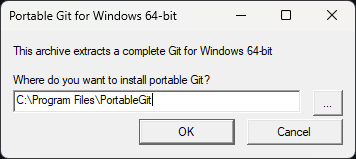
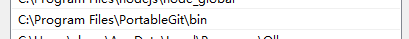
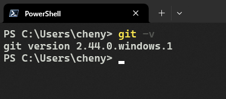

# 章节1 安装Git
> “每天学习新知识是对自己最好的投资。”

本手册默认用户本地使用个人Windows PC开发项目。且Linux大多已经预装或安装极其简单。

## **Windows下安装**
### **便携版Git，简单而不简陋**
推荐使用`Portable`版本，无需在安装界面选择繁琐的选项，点击可执行文件`(.exe)`解压即可。

  

- 建议使用图中路径进行解压。

### **添加用户路径**
为了更方便而且使用更美观的Git，接下来需要将Git安装目录下的`/bin`目录添加至用户的环境变量，添加完成的类似下图。  
- 如果上一个步骤解压的时候严格按照**建议路径**则这步也可以完全按照图中填写。  

> 如何添加*用户环境变量*不在此提及，请自行搜索。

### **开箱体验**
当你完成上述安装之后就可以便捷的使用Git了！  
你可以打开**Windows Terminal**或者别的终端(CMD、PowerShell)，直接输入`git -v`来查看是否有输出当前安装的Git版本，如果输出没有类似以下图，则检查以上各步骤。  

> “Windows 终端是一个新式主机应用程序，它面向你喜爱的命令行 shell，如命令提示符、PowerShell 和 bash（通过适用于 Linux 的 Windows 子系统 (WSL)）。 它的主要功能包括多个选项卡、窗格、Unicode 和 UTF-8 字符支持、GPU 加速文本呈现引擎，你还可用它来创建你自己的主题并自定义文本、颜色、背景和快捷方式。”  -- Microsoft Learn
>
>简言之：Windows Terminal是一个现代且美观的终端程序。

---

**最后更新日期：** 2025年11月2日
