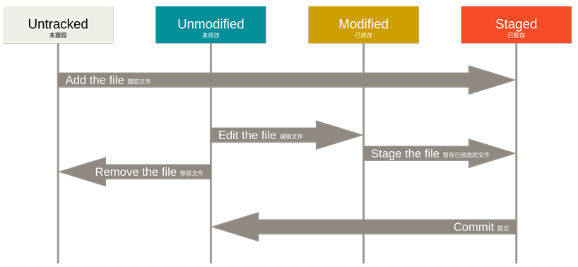

# 章节3 Git基础
> “不积跬步无以至千里，不积小流无以成江海。”

对于Git这个工具的备餐环节已经完成了，现在是时候端上来了。  
本章节开始篇幅较长，但是也是精简过的版本，如果有不严谨的地方请参考[Progit](git_index)这本完全教程。

## **获取Git仓库**
### 具有两种方式
- 将尚未进行版本控制的本地目录转换为仓库。
- 从其他服务器**克隆**一个已经存在的项目仓库。

### 在已有的目录初始化仓库
1. 进入项目目录
2. 执行`git init`
3. 追踪所有的文件并进行初始化提交
```
 git add *  # track all existing files under this directory
 git status  # check current changes, but not necrssary
 git commit -m 'initial commitment'  # leave a comment
```

> 步骤2命令实际上将创建一个名为`.git`的隐藏子目录。

### 克隆远程仓库
适用于团队合作或从**Github**等仓库托管平台下载仓库。

> 注意：此克隆(clone)会下载远程仓库每一个文件及其每一个版本，实际上是下载`.git`文件夹。

使用克隆命令`git clone "urls" `，替换引号中内容为仓库链接。
```
 # 例如现在需要以"user"身份克隆项目仓库"192.168.x.x:example"
 git clone user@192.168.x.x:example  # 可能需要密码
```

## **记录每次更新到仓库**
当本地拥有了一个真实的Git仓库，接下来描述如何继续开发。  

> 请回顾Git绪论中Figure1，了解基本流程。

在Git中，文件具有两种状态，*已追踪(Tracked)*与*未追踪(Untracked)*。前者表明此文件已被纳入版本管理，Git会监控它的变化并随提交被记录。后者则并不会被Git关心。


*Figure1 文件的状态变化周期*

### 检查当前文件状态
使用`git status`可以查看那些文件处于*Figure1*中的哪种状态。

> 使用`git status -s`可以简化文件状态变化输出，使更加直观简洁。

1. 在一个新创建的仓库中使用`git status`则会得到以下输出，在当前分支没有任何提交。
    ```
    On branch main

    No commits yet

    nothing to commit (create/copy files and use "git add" to track)
    ```
2. 初次克隆远程仓库后，所有文件属于已追踪，且并未修改，此时如果使用`git status`则大概率会出现`Already up-to-date`字样。

### 追踪新文件
由于是新创建的文件，它理所当然的不被Git追踪，若需要将其纳入版本管理，则使用`git add README`或者`git add *`来进行追踪。  

> 文件被追踪则会进入*暂存区(Staging Area)*，且称为"暂存"。

1. 如果在一个新仓库中创建一个新的README文件，使用`git status`则有输出如下。
    ```
    On branch main

    No commits yet

    Untracked files:
      (use "git add <file>..." to include in what will be committed)
            README

    nothing added to commit but untracked files present (use "git add" to track)
    ```
    在当前的`main`分支没有提交(commits)，有一个名为`README`的文件没有被追踪(Untracked)，可以使用`git add`来追踪文件。
2. 追踪这个文件，输出如下。
    ```
    On branch main

    No commits yet

    Changes to be committed:
      (use "git rm --cached <file>..." to unstage)
            new file:   README
    ```
    可以看到`new file`字样表明`README`已经被追踪并被暂存，可以提交。

### 暂存已修改的文件
> 如果在追踪`tracked_samp`文件之后再进行修改，则这个文件会同时出现在工作区和暂存区，这是因为Git存储的是文件的版本，之前暂存的是文件修改之前的版本，之后的版本并没有被暂存。  
> 所以，在追踪一个文件之后如果再对它修改，需要再暂存一次。

### 忽略文件
如果是Github上克隆的项目，大多会具有`.gitignore`文件，字面意思理解，其中记录的文件名就是被Git所忽略的，在即使在追踪所有文件时它们也不会被暂存。  

通常程序编译产生的中间文件会被列入忽略文件，使得它们不会混乱清晰的文件结构。

文件`.gitignore`格式规范如下：
- 所有空行或者以` # `开头的行都会被 Git 忽略，相当于注释。
- 可以使用标准的`glob`模式匹配，它会递归地应用在整个工作区中。
- 匹配模式可以以`/`开头防止递归，只当前目录。
- 匹配模式可以以`/`结尾指定目录。
- 要忽略指定模式以外的文件或目录，可以在模式前加上叹号`!`取反。

> glob模式是一种文件匹配模式，后续工作可能广泛应用。忽略文件格式在`Progit`书中有详细举例，感兴趣可以自行了解。

### 提交
接下来就是最终的记录保存，工作区已经不进行变化，暂存区已经准备就绪，接下来就可以提交保存了。

> 防止疏忽，尽量在提交前使用`git status`检查当前文件状态，再进行提交。

使用`git commit -m 'comments' `，将提交信息与命令放在同一行。
```
 [master 463dc4f] Story 182: Fix benchmarks for speed
 2 files changed, 2 insertions(+)
 create mode 100644 README
```
上述代码片段中显示出这次提交是`master`分支的SHA-1校验为`463dc4f`的提交，以及显示出多少文件修订过，多少行添加和删改过。

## **查看提交历史**
在提交了若干更新，又或者克隆了某个项目之后，你也许想回顾下提交历史。  

不传入任何参数的默认情况下，`git log`会按时间先后顺序列出所有的提交，最近的更新排在最上面。这个命令会列出每个提交的SHA-1校验和、作者的名字和电子邮件地址、提交时间以及提交说明。  

一个有用的参数是`--pretty=oneline`，在浏览大量的提交时非常有用。  
这个命令会产生类似下列的历史输出：
```
 $ git log --pretty=oneline
 ca82a6dff817ec66f44342007202690a93763949 changed the version number
 085bb3bcb608e1e8451d4b2432f8ecbe6306e7e7 removed unnecessary test
 a11bef06a3f659402fe7563abf99ad00de2209e6 first commit
```


## **撤消操作**
在任何一个阶段，你都有可能想要撤消某些操作。以下一系列操作：
```
 $ git commit -m 'initial commit'
 $ git add forgotten_file
 $ git commit --amend
```
根据先后顺序，先进行了一次提交，因为疏忽漏追踪了一个文件而暂存忘掉的文件，最后使用`git commit --amend`来重置上次提交，但提交的信息不会改变。  

最终会得到**一个提交**，第二次的`commit`会代替第一次的结果。

接下来的两个小节演示如何操作*暂存区和工作目录*中已修改的文件。 

### 取消暂存的文件
使用`git reset HEAD "reset_file"`，替换包括双引号的内容以取消追踪文件，也就是取消暂存。

> `git reset HEAD "file"`是一个危险的命令。

### 撤消对文件的修改
如果想要放弃自上次提交以来对于`reset_file`的修改，则可以使用`git checkout -- "reset_file"`使更改失效。

> `git checkout — "file"`同样是一个危险的命令，文件在本地的任何修改都会消失。

## **远程仓库的使用**
为了能在任意 Git 项目上协作，你需要知道如何管理自己的远程仓库。

此处举例，使用`git clone https://github.com/schacon/ticgit`，克隆一个远程仓库。

### 查看远程仓库
如果想查看你已经配置的远程仓库服务器，可以运行`git remote -v`命令。它会列出所有远程服务器的简称、地址及权限。  
类似如下：
```
 $ git remote -v
 origin    git@github.com:mojombo/grit.git (fetch)
 origin    git@github.com:mojombo/grit.git (push)
```
> 注意这些远程仓库使用了不同的协议。感兴趣可以在书中`服务器上搭建 Git`章节中了解关于它们的更多信息。

### 添加远程仓库
运行`git remote add <shortname> <url>`添加一个新的远程Git仓库，同时指定一个方便使用的简称：
```
 $ git remote add pb https://github.com/paulboone/ticgit
 $ git remote -v
 origin  https://github.com/schacon/ticgit (fetch)
 origin  https://github.com/schacon/ticgit (push)
 pb  https://github.com/paulboone/ticgit (fetch)
 pb  https://github.com/paulboone/ticgit (push)
```
可以看出，除了克隆时自动添加的仓库之外出现了名为`pb`的新的远程仓库。

### 从远程仓库中抓取与拉取
- 从远程仓库中拉取数据，可以执行`git fetch "remote"`，替换双引号及其中内容为仓库的简称。

> 这个命令会访问远程仓库，从中拉取所有你还没有的数据。   
> 执行完成后，你将会拥有那个远程仓库中所有分支的引用，可以随时合并或查看。

- 运行`git pull`通常会从最初克隆的服务器上抓取数据并自动尝试合并到当前所在的分支。

> 这或许是个更加简单舒服的工作流程。但是需要当前分支设置了跟踪远程分支。

### 推送到远程仓库
当你想分享你的项目时，必须将其推送到上游。   
使用`git push origin master`来将本地的`master`分支推送到远程仓库`origin`中的`master`分支。

> 请注意，如果推送被拒绝，则需要将远程仓库的分支先`git pull`下来。

### 远程仓库的重命名与移除
使用`git remote rename "repo"`来修改一个远程仓库的简写名。   

使用`git remote rm "repo"`来删除远程仓库。替换包含双引号及其中内容。

> 删除远程仓库并不是删除远程服务器上的仓库，而只是删除本地的推送目录中的相应仓库。

---

**最后更新日期：** 2025年11月4日
