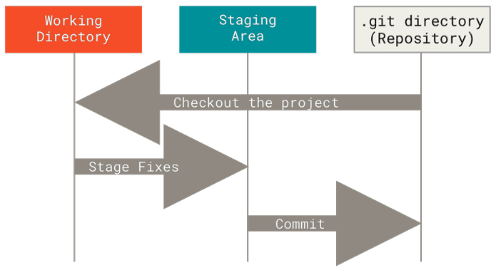

# Git简要操作手册

> “每天学习新知识是对自己最好的投资。”

本手册高度依赖*ProGit - Scott Chacon, Ben Straub*这本书，诸位若有百思不得其解，书尽有详细，亦有相关例子可供操持。

> *ProGit*被广泛视为学习 Git 的权威资料之一，其内容完全开源，托管在 GitHub 上。
> 
>  本手册提供下载方式：

## 什么是版本管理
版本管理是一套用于记录、追踪和控制文件（尤其是源代码）变更的系统和流程，帮助团队协同开发、回溯历史、分支实验，并在需要时快速恢复到任意历史版本。
## 为什么需要版本管理
许多人习惯用复制整个项目目录的方式来保存不同的版本，或许还会改名加上备份时间以示区别。 这么做唯一的好处就是简单，但是特别容易犯错。有时候会混淆所在的工作目录，一不小心会写错文件或者覆盖意想外的文件。

为了解决这个问题，所以需要版本管理。

对于更进一步的团队工作来讲，版本管理是实现团队协作、高效维护、可靠回溯和合规安全的基础设施。
## Git的工作原理
首先了解Git的基本概念，它与具有三种状态：已提交（committed）、已修改（modified）和已暂存（staged）。

> *以下所有操作（文件、数据库等）均为在本地文件系统的相关概念*
- 已修改表示修改了文件，但是还没有保存在数据库中。
- 已暂存表示对一个已修改的当前版本做了标记，使之包含在下次提交的快照中。
- 已提交表示数据已经安全地保存在数据库中。

*Figure 1 Git流程图*

1. 图中工作区（Working Directory）为本地文件夹，可以直观观察以及修改其中的文件。
2. 暂存区（Staging Area）是一个文件，保存了下次将要提交的文件列表信息，了解基本概念即可。
3. 仓库（Repository）是用来保存项目的元数据和对象数据库的地方，它以`.git`隐藏文件存在项目中。简单来说就是保存了所有更改的历史版本的文件夹，是最重要的保存数据的地方。

## 最基本的流程
1. 在工作区创建和修改文件
2. 将需要保存的文件选择性暂存
3. 提交暂存文件至项目仓库

这样你就完成了一次简单的Git流程，保存的文件版本随时可退回。
> 此情可待成追忆，只是当时已惘然。

使用版本管理此情就可以**再追忆**
## 快速开始
[Chapter 1 如何安装Git](chap1.html)

---

**最后更新日期：** 2025年10月21日
